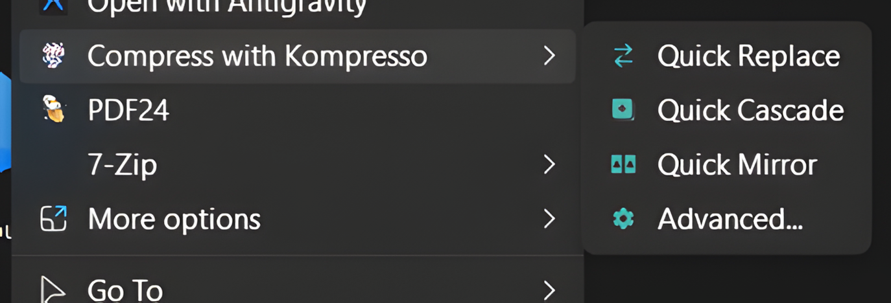
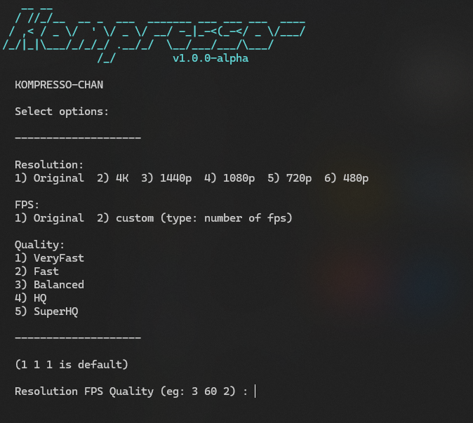
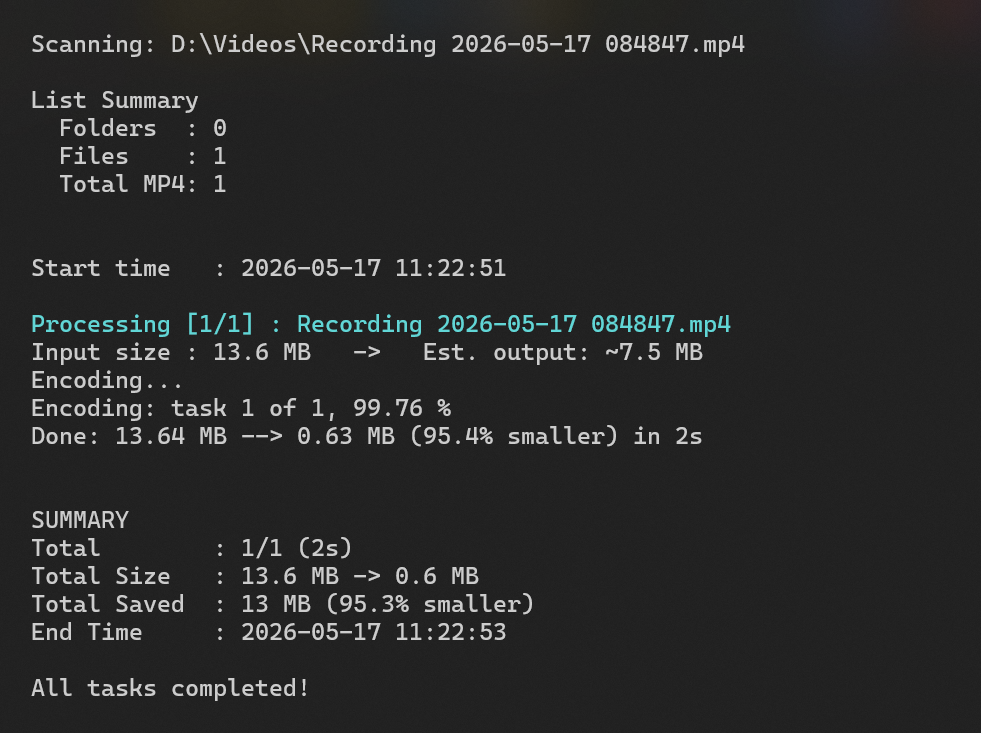
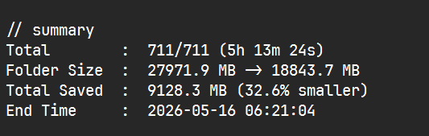

# 🎬 Kompresso-chan


**Kompresso-chan** is a video compressing utility for Windows I built to solve a simple but frustrating problem: my hard drive was constantly running out of space, and I was tired of opening heavy video software just to downscale screen recordings. To get a fast, lightweight context-menu tool, I cooked up this PowerShell wrapper around the legendary **HandBrakeCLI** engine. Instead of hogging resources, it lets you right-click any video file or folder, choose from 24 optimized presets (supporting AV1, HEVC, and H.264), and let it run cleanly in the background. It shrunk my own raw captures by up to 90% while keeping them looking great, so I decided to package it with a simple installer to help others reclaim their disk space too!


ㅤ
<br clear="left">

---

## ✨ Features I Packed Into It

Here are the key things I wanted to make sure the tool handles well:

- **🚀 Unified Context Menu**: Right-click any file, folder, or empty space in Explorer to access a clean submenu with four options:
  - **Quick Replace** — compresses instantly with default settings (Original res, Original FPS, VeryFast quality), overwriting the original.
  - **Quick Cascade** — same defaults, but saves as `_kompressochan.mp4` alongside the original.
  - **Quick Mirror** — same defaults, recreates the full folder structure for bulk processing.
  - **Advanced...** — opens the full interactive prompt with all 24 presets and workflow options.
- **📂 Bulk Processing**: I made sure it can handle entire directory trees or dozens of selected files at once without breaking a sweat.
- **🛠️ Three Intelligent Workflow Modes**:
  - **Replace**: Direct in-place replacement of your original files (perfect for maximizing space).
  - **Cascade**: Creates a compressed copy alongside the original file with a `_kompressochan` suffix so you can compare quality.
  - **Mirror**: Recreates an entire folder structure, compressing video assets while copying all non-video files (images, subtitles, etc.) completely intact.
- **📊 Logging & Summaries**: Automatically generates session logs showing compression ratios, time elapsed, and total disk space saved.
- **⚡ Flexible Presets**: I built a simple 3-step selection system where you pick resolution (Original/4K/1440p/1080p/720p/480p), FPS (Original or custom), and quality level (Very Fast/Fast/Balanced/HQ/Super HQ) in one quick input.
- **😴 Post-Task Auto-Shutdown**: An optional setting to automatically shut down your PC after a long overnight queue finishes.
- **💻 Native CLI Support**: If you prefer terminals like I do, you can run the compression directly via the global `komchan` command.
- **⚡ Quick Compression Flag**: Use `-quick` from the CLI to skip all prompts and compress with defaults. Combine with other flags (e.g., `-quick -m replace -r 480p`) to override individual settings.

---

## 📥 How to Install It

I wanted to make the setup as frictionless as possible, so I built simple C-based wrappers to handle the heavy lifting:

### Method 1: The Easiest Way (Recommended)
1. **Download/Clone** this repository to a folder of your choice (e.g., `C:\Tools\Kompresso-chan`).
2. Find `install.exe` in the root folder.
3. **Right-click `install.exe`** and select **Run as Administrator**.
4. The installer will automatically:
   - Download/deploy HandBrakeCLI if it's missing.
   - Configure the global `komchan` terminal command.
   - Set up the right-click context menu integrations.
   - Place a handy desktop shortcut for drag-and-drop batching.

### Method 2: Manual PowerShell Setup
1. Open PowerShell as **Administrator**.
2. Navigate into the `dependencies` directory.
3. Run the installer script directly:
   ```powershell
   Set-ExecutionPolicy Bypass -Scope Process -Force; .\install.ps1
   ```

> [!NOTE]
> You might need to restart Windows Explorer or your open terminal windows for the context menu and global `komchan` command to load.

---

## 🚀 How I Use It

### 1. The Right-Click Menu
This is my everyday go-to:
- Select one or more files/folders, right-click, and choose **Compress with Kompresso**.
- Pick your workflow:
  - **Quick Replace / Quick Cascade / Quick Mirror** — instantly compresses with default settings (Original res, Original FPS, VeryFast quality).
  - **Advanced...** — opens the full interactive prompt to choose your preset and mode.

<p>
  
</p>

<p>
  
</p>

### 2. The Terminal (CLI)
For quick single commands, open any shell (CMD, PowerShell, or Windows Terminal) and type:
```powershell
# Compress a single video file (interactive prompt, default: 1 1 1)
komchan "D:\Movies\MyVideo.mp4"

# Queue up a whole folder
komchan "D:\Recordings"

# Skip the prompt with short flags
komchan "D:\Movies\MyVideo.mp4" -r 1080p -f 60 -q fast
komchan "D:\Movies\MyVideo.mp4" -r 4 -f 30 -q 2

# Or use a single preset string
komchan "D:\Movies\MyVideo.mp4" -preset "1080p 60 fast"

# Quick compression with defaults (Original/Original/VeryFast/Cascade)
komchan "D:\Movies\MyVideo.mp4" -quick

# Quick compression with overrides
komchan "D:\Movies\MyVideo.mp4" -quick -m replace -r 480p

# Quick compression with smart mode enabled
komchan "D:\Movies\MyVideo.mp4" -quick -m replace -smart

# Auto-shutdown after encoding completes
komchan "D:\Recordings" -r 720p -f 30 -q 2 -shut

# Disable shutdown explicitly
komchan "D:\Recordings" -r 720p -f 30 -q 2 -shut:n

# Cascade mode (creates _kompressochan.mp4 next to original)
komchan "D:\Movies\MyVideo.mp4" -r 720p -f 30 -q 2 -m cascade

# Mirror mode for folder batch (recreates folder structure)
komchan "D:\Recordings" -r 1080p -f 60 -q fast -m mirror

# Session log only
komchan my_list.txt -r 4k -f 1 -q balanced -l session

# No logs at all
komchan "D:\Movies" -r 1440p -f 30 -q fast -l none

# Combine flags for overnight batch run
komchan "D:\Movies" -r 1440p -f 30 -q fast -shut -l both

# View help and usage documentation
komchan --help
```

**Resolution options:** `1`/`original`, `2`/`4k`, `3`/`1440p`, `4`/`1080p`, `5`/`720p`, `6`/`480p`
**FPS options:** `1` (original) or any number (e.g. `30`, `60`, `23.976`)
**Quality options:** `1`/`veryfast`, `2`/`fast`, `3`/`balanced`, `4`/`hq`, `5`/`superhq`
**Mode options:** `1`/`replace`, `2`/`cascade`, `3`/`mirror` (case-insensitive)
**Flags:** `-quick` (skip prompts), `-smart` (skip if larger), `-shut` (auto-shutdown), `-l`/`-log` (log mode: session/folder/both/none), `-m`/`-mode` (processing mode)

### 3. Drag-and-Drop Batch Lists
For massive batch runs, I usually create a simple `.txt` file listing absolute file paths (one per line) and then drag-and-drop the file directly onto the desktop shortcut:
```powershell
komchan "C:\Users\You\Desktop\my_batch_list.txt"
```

### 🖥️ Interactive Progress HUD
When running, the console shows a live overview of current statistics, total queue progress, and HandBrake's progress updates:
<p>
  
</p>

---

## 📖 CLI Reference

Run `komchan --help` to see this in your terminal. Here's a quick breakdown of every flag:

### Basic Usage
```
komchan [Path]              - Start compression for a file, folder, or .txt list.
komchan --help, -h          - Show the help guide.
komchan --uninstall         - Uninstall Kompresso-chan from your system.
```

### Flags

| Flag | Aliases | Description |
| :--- | :--- | :--- |
| `-r` | `-res` | Resolution: `1`/`original`, `2`/`4k`, `3`/`1440p`, `4`/`1080p`, `5`/`720p`, `6`/`480p` |
| `-f` | `-fps` | FPS: `1` = keep original, or any number like `30`, `60`, `23.976` |
| `-q` | `-qual` | Quality: `1`/`veryfast`, `2`/`fast`, `3`/`balanced`, `4`/`hq`, `5`/`superhq` |
| `-m` | `-mode` | Processing mode: `replace`, `cascade`, or `mirror` (case-insensitive) |
| `-preset` | `-p` | Single string combining res/fps/qual, e.g. `"1080p 60 fast"` |
| `-quick` | — | Skip all prompts, use defaults. Append `:y/:n` or `y/n` to toggle. Combine with other flags to override. |
| `-smart` | — | Replace/Mirror mode: skip if compressed is larger. Replace skips replacement; Mirror copies original instead. Append `:y/:n` or `y/n` to toggle. Prompts interactively if not passed. |
| `-shut` | — | Auto-shutdown PC after all encoding finishes. Append `:y/:n` or `y/n` to toggle. |
| `-l` | `-log` | Log mode: `session`/`s` (session only), `folder`/`f` (folder only), `both`/`b` (both), `none`/`n` (no logs). Default: `session`. |

### Resolution Options

| Value | Label | Behavior |
| :--- | :--- | :--- |
| `1` / `original` | Original | Keep source resolution |
| `2` / `4k` | 4K | Scale to 2160p max |
| `3` / `1440p` | 1440p | Scale to 1440p max |
| `4` / `1080p` | 1080p | Scale to 1080p max |
| `5` / `720p` | 720p | Scale to 720p max |
| `6` / `480p` | 480p | Scale to 480p max |

### FPS Options

| Value | Behavior |
| :--- | :--- |
| `1` | Keep source framerate |
| `<number>` | Set custom FPS (e.g. `30`, `60`, `23.976`) |

### Quality Options

| Value | Label | Encoder Preset | RF |
| :--- | :--- | :--- | :--- |
| `1` / `veryfast` | VeryFast | veryfast | 24 |
| `2` / `fast` | Fast | fast | 22 |
| `3` / `balanced` | Balanced | medium | 20 |
| `4` / `hq` | HQ | slow | 18 |
| `5` / `superhq` | SuperHQ | slower | 16 |

### Processing Modes

| Value | Mode | Behavior |
| :--- | :--- | :--- |
| `1` / `replace` | Replace | Overwrite the original file with the compressed version. |
| `2` / `cascade` | Cascade | Save as `original_kompressochan.mp4` in the same folder. |
| `3` / `mirror` | Mirror | Recreate the folder structure for bulk processing. Falls back to cascade if only files are given. |

---

## 🛠️ The 3 Workflow Modes Explained

To cover different needs, I built three distinct ways to handle files:

| Mode | What it does | Why I use it |
| :--- | :--- | :--- |
| **1. Replace** | Overwrites the original file with the compressed version. | When I just want to save raw disk space on long game captures and don't care about the original bitrates. |
| **2. Cascade** | Saves the compressed file as `filename_kompressochan.mp4` in the same directory. | When I want to compare quality side-by-side or keep the original as a backup. |
| **3. Mirror** | Recreates your source folder tree in a new directory named `Folder_kompressochan`. | When I want to compress an entire library of courses/shows while keeping subfolders, subtitles, and images untouched. |

---

## 📊 Analytics & Saving Logs

I love seeing how much space I've reclaimed, so I built two logging formats depending on how the session is run:
- **Folder Log (`compression_log.txt`)**: A static log saved directly in the destination folder.
- **Session Log (`session_compression_log_YYYY-M-D-HH.mm.ss.txt`)**: A timestamped log created next to your batch list file when using `.txt` inputs.

**Each log documents:**
- The selected preset and mode.
- Success/Failure status and elapsed time for each file.
- **Final Summary**: Absolute disk space saved in MB/GB and compression ratio percentage.
- **Interrupted Session Recovery**: If a long session gets interrupted, it prints the last incomplete file so you can resume exactly where you left off.

### 📈 Console Session Summary
At the end of each run, it prints a clean breakdown of the total space saved to keep you updated:
<p>
  
</p>

---

## 📤 How to Uninstall It

If the tool isn't for you, I've made it simple to remove everything cleanly:
1. Locate `uninstall.exe` in the root folder, right-click it, and run as **Administrator**.
2. Alternatively, run `uninstall.ps1` from the `dependencies` folder using PowerShell (Admin).
3. The script will safely remove context menu entries, global path variables, and program files.

---

## ⚠️ Requirements & A Tiny Disclaimer

- **OS**: Windows 10 or 11 (64-bit).
- **PowerShell**: 5.1 or higher.
- **Dependencies**: HandBrakeCLI (which is included in the package and managed for you).

*Disclaimer: Since this is a personal project, it's provided "as-is". I've spent a lot of time making it stable, but I highly recommend backing up your critical videos before running **Replace** mode—just to be 100% safe! This tool is independent and not affiliated with the official HandBrake team.*
