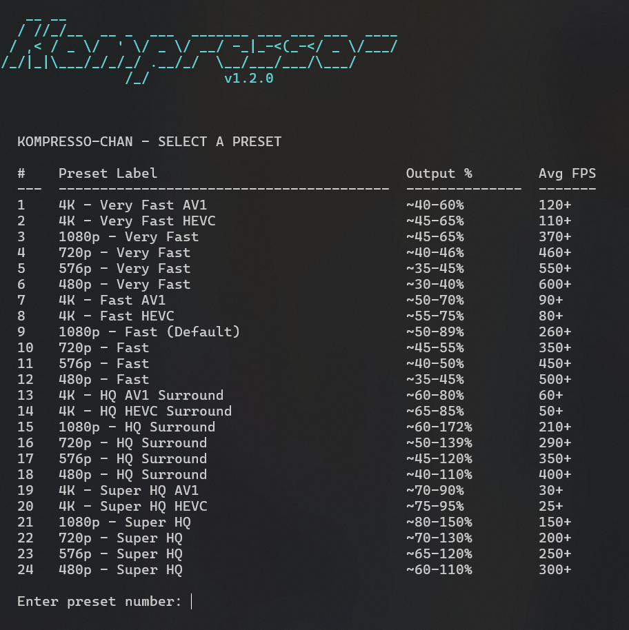

# 🎬 Kompresso-chan


**Kompresso-chan** is a video compressing utility for Windows I built to solve a simple but frustrating problem: my hard drive was constantly running out of space, and I was tired of opening heavy, complex video software just to downscale raw screen recordings. I wanted a fast, lightweight way to batch-compress files directly from my Windows Explorer context menu. To do that, I cooked up this tool as a PowerShell-based wrapper around the legendary **HandBrakeCLI** engine. Instead of hogging system resources, it lets you right-click any video file or folder, choose from 24 carefully optimized presets (supporting modern codecs like AV1, HEVC, and H.264), and let it run cleanly in the background. It shrunk my own raw captures and media folders by up to 90% while keeping them looking great, so I decided to package it up with a simple installer for anyone else looking to reclaim their disk space!

<br clear="left">

---

## ✨ Features I Packed Into It

Here are the key things I wanted to make sure the tool handles well:

- **🚀 Context Menu Integration**: You can select any video file or folder, right-click, and select **"Compress with Kompresso-chan"** to start instantly.
- **📂 Bulk Processing**: I made sure it can handle entire directory trees or dozens of selected files at once without breaking a sweat.
- **🛠️ Three Intelligent Workflow Modes**:
  - **Replace**: Direct in-place replacement of your original files (perfect for maximizing space).
  - **Cascade**: Creates a compressed copy alongside the original file with a `_kompressochan` suffix so you can compare quality.
  - **Mirror**: Recreates an entire folder structure, compressing video assets while copying all non-video files (images, subtitles, etc.) completely intact.
- **📊 Logging & Summaries**: Automatically generates session logs showing compression ratios, time elapsed, and total disk space saved.
- **⚡ 24 Performance Presets**: I pre-configured 24 HandBrake presets ranging from 4K AV1/HEVC all the way down to mobile-friendly 480p, optimized for speed and visual quality.
- **😴 Post-Task Auto-Shutdown**: An optional setting to automatically shut down your PC after a long overnight queue finishes.
- **💻 Native CLI Support**: If you prefer terminals like I do, you can run the compression directly via the global `komchan` command.

---

## 📥 How to Install It

I wanted to make the setup as frictionless as possible, so I built simple C-based wrappers to handle the heavy lifting:

### Method 1: The Easiest Way (Recommended)
1. **Download/Clone** this repository to a folder of your choice (e.g., `C:\Tools\Kompresso-chan`).
2. Find `install.exe` in the root folder.
3. **Right-click `install.exe`** and select **Run as Administrator**.
4. The installer will automatically:
   - Download/deploy HandBrakeCLI if it's missing.
   - Configure the global `komchan` terminal command.
   - Set up the right-click context menu integrations.
   - Place a handy desktop shortcut for drag-and-drop batching.

### Method 2: Manual PowerShell Setup
1. Open PowerShell as **Administrator**.
2. Navigate into the `dependencies` directory.
3. Run the installer script directly:
   ```powershell
   Set-ExecutionPolicy Bypass -Scope Process -Force; .\install.ps1
   ```

> [!NOTE]
> You might need to restart Windows Explorer or your open terminal windows for the context menu and global `komchan` command to load.

---

## 🚀 How I Use It

### 1. The Right-Click Menu
This is my everyday go-to:
- Select one or more files/folders, right-click, and choose **Compress with Kompresso-chan**.
- A custom interactive prompt will pop up asking you to pick your favorite preset and execution mode.

<p>
  
</p>

### 2. The Terminal (CLI)
For quick single commands, open any shell (CMD, PowerShell, or Windows Terminal) and type:
```powershell
# Compress a single video file
komchan "D:\Movies\MyVideo.mp4"

# Queue up a whole folder
komchan "D:\Recordings"

# View my help and usage documentation
komchan --help
```

### 3. Drag-and-Drop Batch Lists
For massive batch runs, I usually create a simple `.txt` file listing absolute file paths (one per line) and then drag-and-drop the file directly onto the desktop shortcut:
```powershell
komchan "C:\Users\You\Desktop\my_batch_list.txt"
```

### 🖥️ Interactive Progress HUD
When running, the console shows a live overview of current statistics, total queue progress, and HandBrake's progress updates:
<p>
  
</p>

---

## 🛠️ The 3 Workflow Modes Explained

To cover different needs, I built three distinct ways to handle files:

| Mode | What it does | Why I use it |
| :--- | :--- | :--- |
| **1. Replace** | Overwrites the original file with the compressed version. | When I just want to save raw disk space on long game captures and don't care about the original bitrates. |
| **2. Cascade** | Saves the compressed file as `filename_kompressochan.mp4` in the same directory. | When I want to compare quality side-by-side or keep the original as a backup. |
| **3. Mirror** | Recreates your source folder tree in a new directory named `Folder_kompressochan`. | When I want to compress an entire library of courses/shows while keeping subfolders, subtitles, and images untouched. |

---

## 📊 Analytics & Saving Logs

I love seeing how much space I've reclaimed, so I built two logging formats depending on how the session is run:
- **Folder Log (`compression_log.txt`)**: A static log saved directly in the destination folder.
- **Session Log (`session_compression_log_YYYY-M-D-HH.mm.ss.txt`)**: A timestamped log created next to your batch list file when using `.txt` inputs.

**Each log documents:**
- The selected preset and mode.
- Success/Failure status and elapsed time for each file.
- **Final Summary**: Absolute disk space saved in MB/GB and compression ratio percentage.
- **Interrupted Session Recovery**: If a long session gets interrupted, it prints the last incomplete file so you can resume exactly where you left off.

### 📈 Console Session Summary
At the end of each run, it prints a clean breakdown of the total space saved to keep you updated:
<p>
  
</p>

---

## 📤 How to Uninstall It

If the tool isn't for you, I've made it simple to remove everything cleanly:
1. Locate `uninstall.exe` in the root folder, right-click it, and run as **Administrator**.
2. Alternatively, run `uninstall.ps1` from the `dependencies` folder using PowerShell (Admin).
3. The script will safely remove context menu entries, global path variables, and program files.

---

## ⚠️ Requirements & A Tiny Disclaimer

- **OS**: Windows 10 or 11 (64-bit).
- **PowerShell**: 5.1 or higher.
- **Dependencies**: HandBrakeCLI (which is included in the package and managed for you).

*Disclaimer: Since this is a personal project, it's provided "as-is". I've spent a lot of time making it stable, but I highly recommend backing up your critical videos before running **Replace** mode—just to be 100% safe! This tool is independent and not affiliated with the official HandBrake team.*
